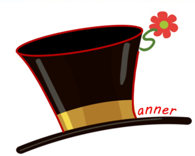

<html lang="en">
<head>
	<title>Planner Hats</title>
	<meta charset="UTF-8">
	<meta name="keywords" content="event, plan, Meetup, Ottawa, visualization, data">
	<meta name="description" content="A Visualization tool to help you plan your next Meetup event.">
 	<meta name="viewport" content="width=device-width, initial-scale=1.0">
	<meta name="author" content="Planner Hats">
	<link rel="stylesheet" href="PlannerHatsStyle.css">
</head>
<body>
	

	

		<h1>Planner Hats</h1>
		
Hosna Hamdieh &bull; Honeyeh Yazdizadeh &bull; Adrian Bolesnikov &bull; Tina Yadizadeh &bull; Samantha Sieklicki

	

	

		
<a href="index.html">ABOUT</a><a href="Group.html">GROUP PLANNING STEP 1</a><a href="EventTime.html">BEST TIMES STEP 2</a><a href="Event.html">EVENT PLANNING STEP 3</a><a href="Resources.html">ADDITIONAL RESOURCES</a>

	

	

		
 <b>Quick look at the problem:</b> Event planning is a hard and time consuming process and it would be a waste if not enough people show up. To make sure you are on the right path it is vital to both know your potential competitors and the times they are holding their events. Finding the perfect time might not be possible without an overall understanding of the domain's active players (groups) or popular event times and days.

		
 <b>Our aim:</b> Helping event planners to find out about other events, groups holding them, and when they can have their own events.

	

	

		
<a href="index.html">ABOUT</a><a href="Group.html">GROUP PLANNING STEP 1</a><a href="EventTime.html">BEST TIMES STEP 2</a><a href="Event.html">EVENT PLANNING STEP 3</a><a href="Resources.html">ADDITIONAL RESOURCES</a>

	

	

</body>
</html>
